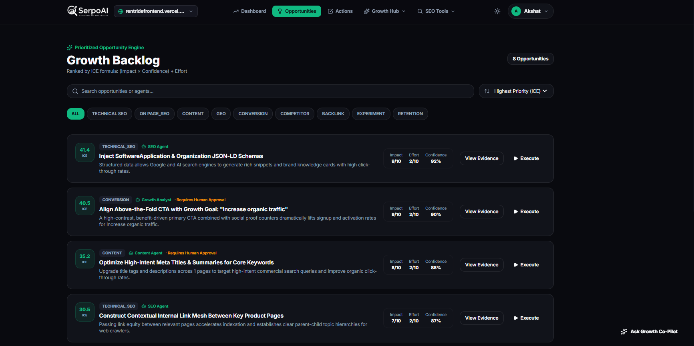
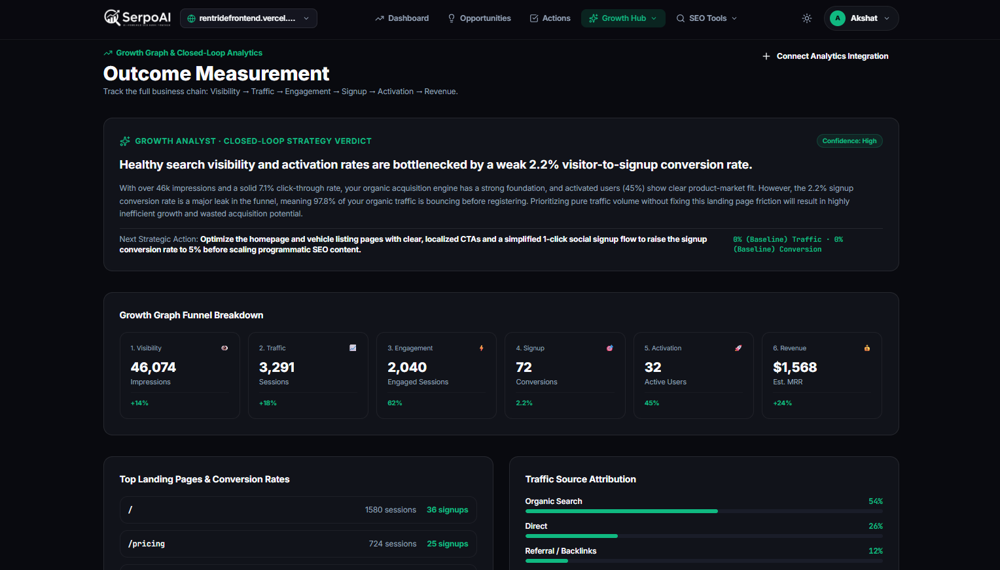
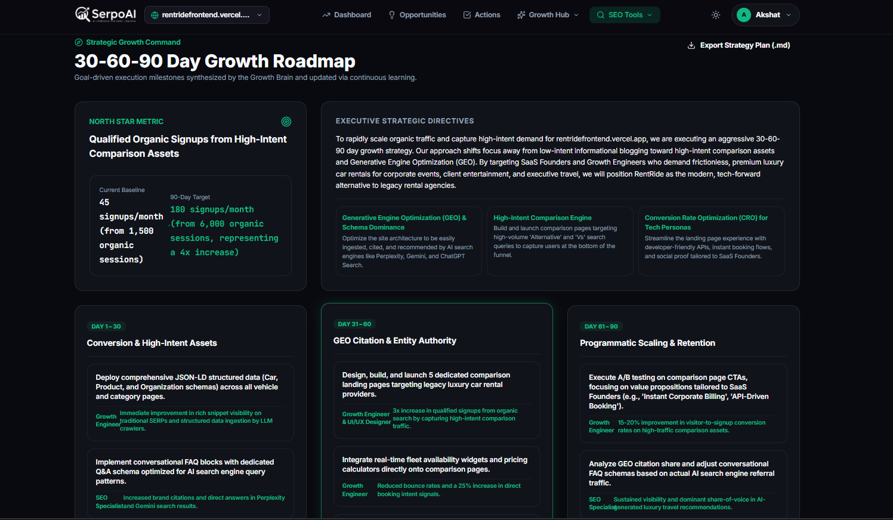
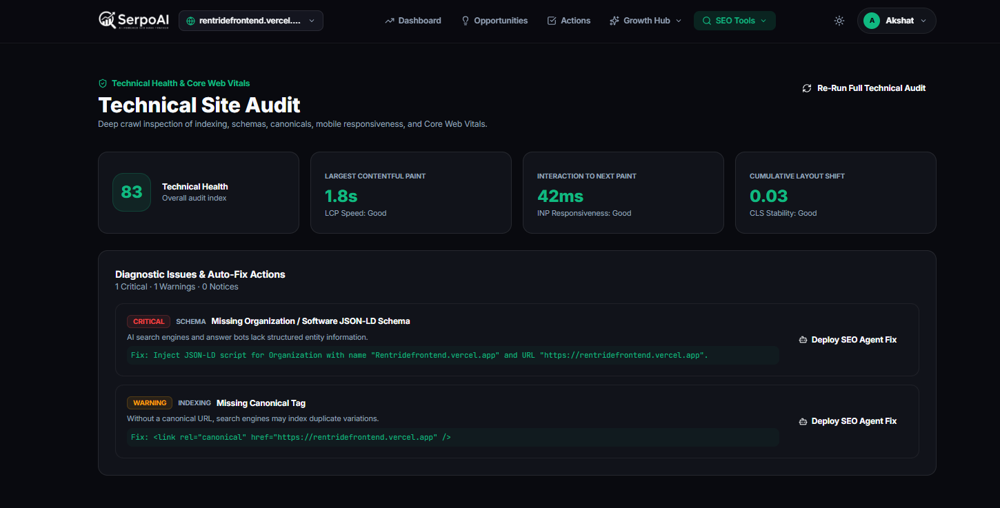
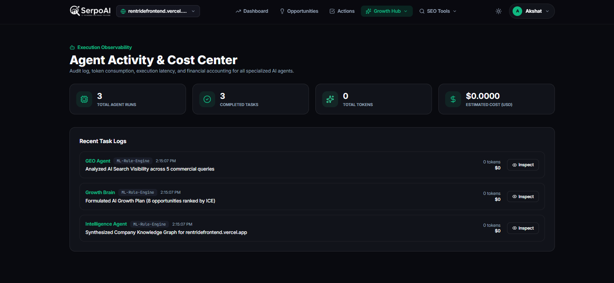

<p align="center">
  
</p>

<h1 align="center">SerpoAI</h1>
<p align="center">
  <strong>An Autonomous Search Growth Operating System</strong><br/>
  <em>"Turn Search Data Into Compounding Organic Growth."</em>
</p>

<p align="center">
  <a href="https://github.com/AkshatKardak/SEO">
    
  </a>
  <a href="https://github.com/AkshatKardak/SEO/blob/main/LICENSE">
    
  </a>
  
  
</p>

<p align="center">
  <a href="#-product-dashboard--views">Dashboard Views</a> •
  <a href="#-product-positioning">Positioning</a> •
  <a href="#-core-operating-loop">Growth Loop</a> •
  <a href="#-core-features">Core Features</a> •
  <a href="#-unique-features">Unique Features</a> •
  <a href="#-machine-learning-ml-integration">ML Integration</a> •
  <a href="#-deployment-guide-render--netlify">Deployment</a> •
  <a href="#-author">Author</a>
</p>

---

## 📸 Product Dashboard & Views

### Autonomous Growth Command Center
<p align="center">
  
</p>

### Feature Suite Overview

| Generative Engine Optimization (GEO) Radar | ICE-Ranked Opportunity Backlog |
| :---: | :---: |
|  |  |

| 6-Tier Funnel Growth Analytics | 30-60-90 Day Strategic Roadmap |
| :---: | :---: |
|  |  |

| Deep Technical Site Audit | Autonomous Agent Activity & Observability |
| :---: | :---: |
|  |  |

---

## 🧭 Product Positioning

**SerpoAI is NOT simply an SEO audit tool.**

> **"SerpoAI doesn't just tell you what is wrong. It determines what matters, predicts what will have impact, helps execute it, measures the result, and learns from the outcome."**

SerpoAI discovers your highest-impact SEO and AI-search opportunities, predicts their potential impact using mathematical ICE scoring and machine learning, helps execute approved fixes with specialized AI agents, and measures what actually moves traffic, conversions, and revenue.

---

## 🔄 Core Operating Loop

$$\Large \textbf{SCAN} \longrightarrow \textbf{PRIORITIZE} \longrightarrow \textbf{APPROVE} \longrightarrow \textbf{DEPLOY} \longrightarrow \textbf{MEASURE}$$

1. **SCAN**: Deep multi-page crawler and sitemap parser inspects HTML structure, metadata, canonical tags, and structured schema data.
2. **PRIORITIZE**: Mathematical ICE formula $\left(\frac{\text{Impact} \times \text{Confidence}}{\text{Effort}} \times 10\right)$ scores opportunities so you fix high-traffic wins first.
3. **APPROVE**: Strict Human-in-the-Loop review ensures zero unauthorized code changes. Every optimization produces an interactive diff.
4. **DEPLOY**: 1-click GitHub Pull Request dispatch via **Serpo Bot** or instant framework-agnostic code snippet copy.
5. **MEASURE**: Tracks post-deployment rank improvements, CTR gains, and AI Answer Engine citations over time.

---

## 🚀 Core Features

- **Deep Technical Site Audit**: Crawls pages to detect missing meta tags, broken canonicals, heading hierarchy issues, and Core Web Vitals bottlenecks.
- **ICE-Ranked Opportunity Engine**: Prioritizes growth fixes using mathematical Impact, Confidence, and Effort scoring to maximize search ROI.
- **Generative Engine Optimization (GEO) Radar**: Audits brand citation presence across ChatGPT, Perplexity, Gemini, and Google AI Overviews.
- **1-Click Code Patch Generator**: Creates production-ready JSON-LD schemas (Organization, Article, FAQ, Product), robots.txt rules, and OpenGraph tags.
- **Multi-Page Sitemap XML Crawler**: Discovers and prioritizes key subpages (pricing, product, blog) protected by SSRF cloud sandbox filters.
- **Daily Keyword Rank Tracker**: Monitors Google keyword positions on daily or weekly schedules with rank history graphs.
- **Executive PDF & Markdown Reports**: Generates professional stakeholder audit briefs with 1-click PDF download.
- **Secure Clerk Authentication**: Enterprise-grade single sign-on with multi-tenant workspace protection.

---

## 🌟 Unique Features

- **GitHub PR / Webhook Dispatcher ("Serpo Bot")**: Automatically opens a new branch, commits the verified SEO fix, and dispatches a GitHub Pull Request with ML safety validation scores and automated test outputs.
- **Automated Keyword Cannibalization Graph**: An interactive cluster visualization detecting when multiple pages on your website compete for identical search terms, with 1-click canonicalization, 301 redirects, and semantic differentiation patches.
- **Google Search Console (GSC) Striking Distance Quick Wins**: Mathematical CTR gap analysis identifying queries ranking in positions 4–10 with high impressions and low clicks, generating 1-click meta title rewrites to capture lost traffic.
- **Closed-Loop Growth Memory**: Vector-backed memory tracking verified before-and-after SERP outcomes, learning which optimizations yield maximum rank velocity for your niche.

---

## 🧠 Machine Learning (ML) Integration

SerpoAI uses machine learning directly inside each core feature for high-speed deterministic prediction:

- **ICE Opportunity Ranking**: Bayesian probability scoring calculates expected traffic lift and ranks tasks by mathematical priority.
- **Keyword Cannibalization Radar**: Jaccard similarity and intent vector clustering detect semantic query overlap between internal pages.
- **GSC Quick Wins & CTR Lift**: Striking-distance regression model compares actual CTR against benchmark curves to compute predicted monthly click gains.
- **Patch Safety Verification**: AST syntax linter and Schema.org specification validator compute a 0–100% safety confidence score before git dispatch.
- **Time-Series Anomaly Detection**: Isolation Forest and rolling Z-score filters flag sudden ranking drops or CTR anomalies against historical baselines.
- **30-Day Growth Forecasting**: Holt-Winters exponential smoothing projects future search traffic with 95% confidence intervals.

---

## 🌐 Deployment Guide (Render + Netlify)

### 1. Deploying Backend & ML Service on Render
1. **Backend Web Service (`server/`)**:
   - Create a **New Web Service** on [Render](https://render.com).
   - Root Directory: `server`
   - Environment: `Node`
   - Build Command: `npm install`
   - Start Command: `npm start`
   - Environment Variables:
     - `MONGODB_URI`: Your MongoDB Atlas connection URI
     - `JWT_SECRET`: Secure random string
     - `PORT`: `5000`
     - `GROQ_API_KEY` / `GEMINI_API_KEY` / `OPENROUTER_API_KEY`: At least one active AI key for generative code diffs
     - `ML_SERVICE_URL`: (Optional) URL of the Python ML service

2. **Python ML Service (`ml-service/`)** *(Optional for standalone Python microservice)*:
   - Create a **New Web Service** on Render.
   - Root Directory: `ml-service`
   - Environment: `Python 3`
   - Build Command: `pip install -r requirements.txt`
   - Start Command: `uvicorn app.main:app --host 0.0.0.0 --port 8000`

### 2. Deploying Frontend on Netlify
1. Connect your repository on [Netlify](https://www.netlify.com).
2. Configure build settings:
   - **Base directory**: `client`
   - **Build command**: `npm run build`
   - **Publish directory**: `client/dist`
3. Add Environment Variable:
   - `VITE_API_URL`: Your deployed Render server URL (e.g. `https://serpoai-backend.onrender.com/api`)
4. Single-Page Application (SPA) Routing:
   - The included `client/public/_redirects` file ensures client-side routing works on page refresh with zero 404s.

---

## 📁 Repository Structure

```
seo-rank-tracker-main/
│
├── client/                                 # React + TypeScript + Vite + Tailwind CSS
│   ├── public/                             # Static Assets, Screenshots & Netlify _redirects
│   ├── src/
│   │   ├── components/                     # High-Impact Cards, Radar & Area Charts
│   │   ├── pages/                          # Dashboard, GEO, Opportunities, Action Center
│   │   └── services/api.ts                 # Axios API Client with ML Services
│   └── package.json
│
├── server/                                 # Express + Node.js Backend API
│   ├── ai/providers/                       # Multi-Provider Cascade (Groq, Gemini, OpenRouter)
│   ├── controllers/                        # Project, Opportunity, GEO, & Audit Controllers
│   ├── models/                             # Mongoose Schemas (Opportunity, Memory, Project)
│   ├── routes/                             # Express Routers (/api/v1/*)
│   ├── services/
│   │   ├── mlClientService.js              # ML Scoring + Bayesian Statistical Engine
│   │   ├── growthBrainService.js           # Growth Brain Knowledge Synthesis
│   │   ├── geoService.js                   # Generative Engine Optimization Engine
│   │   └── crawlerService.js               # SSRF-Safe Cloud Crawler
│   └── server.js
│
└── ml-service/                             # Python FastAPI Machine Learning Service
    ├── app/
    │   ├── main.py                         # FastAPI App Entrypoint & Healthcheck
    │   ├── models/
    │   │   ├── opportunity_ranker.py       # ML Outcome Probability & Lift Estimator
    │   │   ├── anomaly_detector.py         # IsolationForest & Rolling Z-Score Radar
    │   │   └── traffic_forecaster.py       # Autoregressive Time-Series Projection
    │   └── routes/                         # /api/ml/predictions, /anomalies, /forecasts
    └── requirements.txt
```

---

## 🛡️ Security & Privacy
- **SSRF Defense**: Strict CIDR IP blocklists at the DNS resolution layer protect internal cloud metadata endpoints.
- **Human-in-the-Loop**: High-risk code patches and structural redirects require explicit operator approval.
- **Secure Token Encryption**: AES-256 encrypted OAuth credential storage for third-party integrations.

---

## 📄 License
Distributed under the MIT License. See [LICENSE](LICENSE) for more information.

---

## 👤 Author
**Akshat Kardak**  
- GitHub: [@AkshatKardak](https://github.com/AkshatKardak)  
- Repository: [SerpoAI — Autonomous Search Growth OS](https://github.com/AkshatKardak/SEO)
