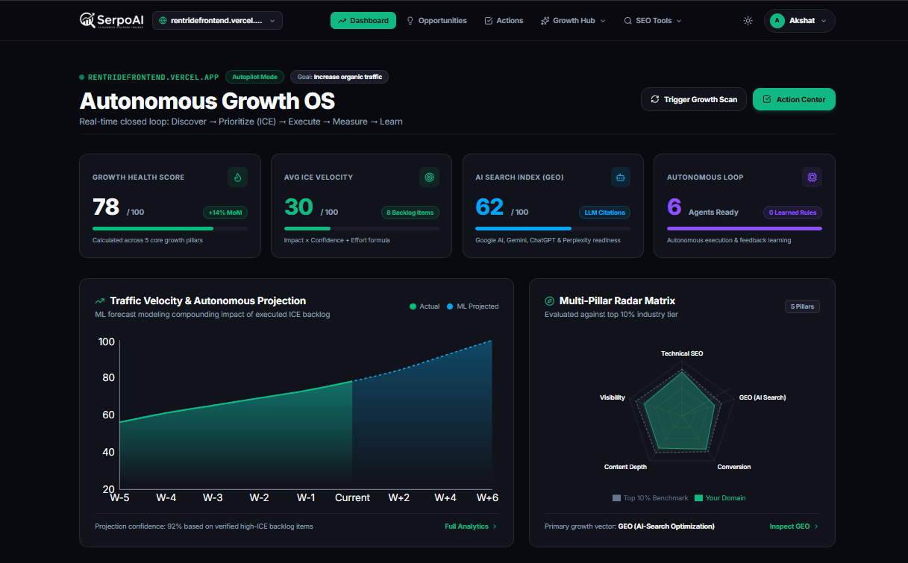
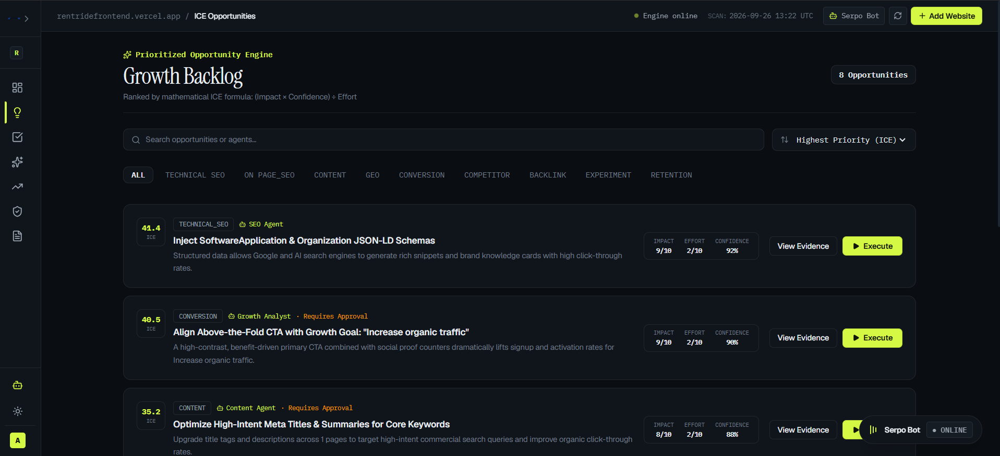
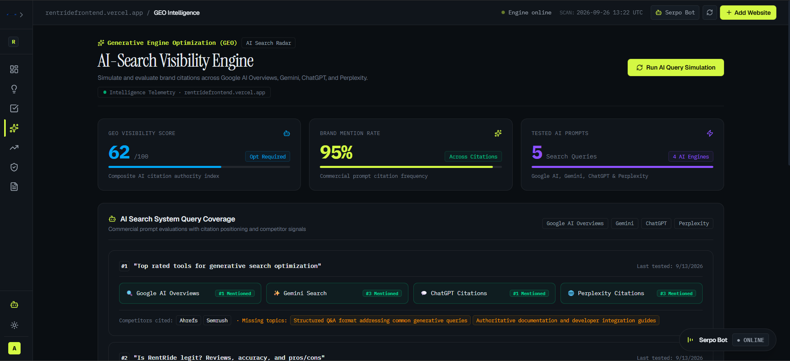
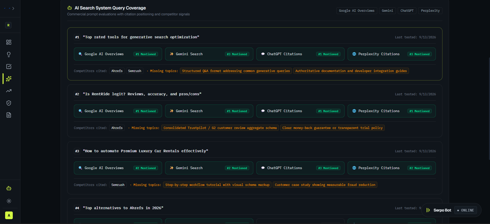
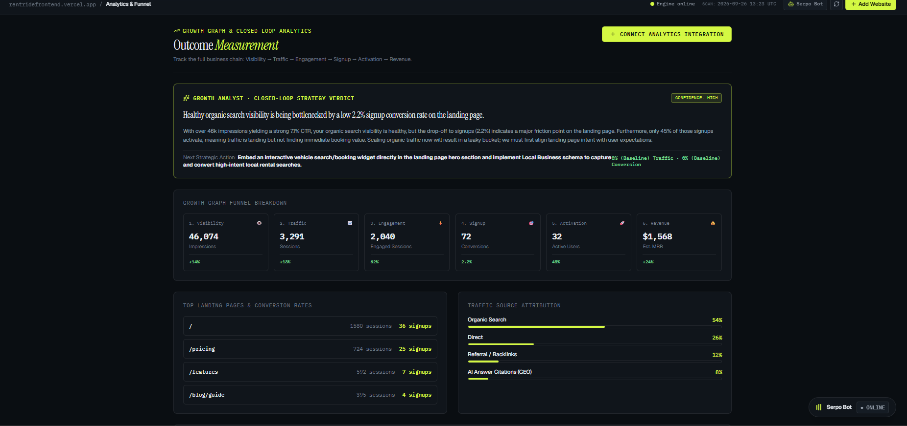
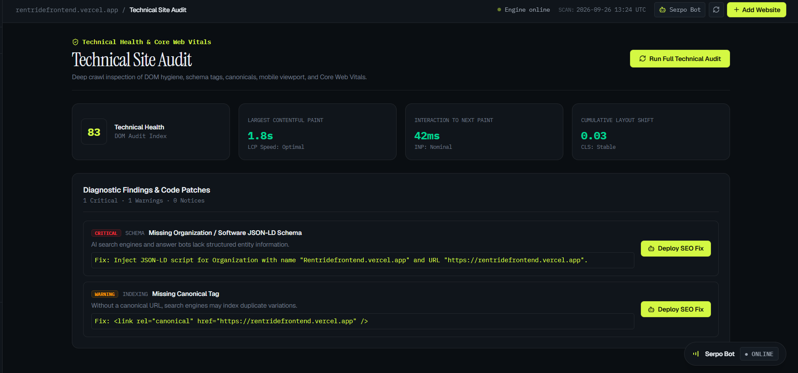
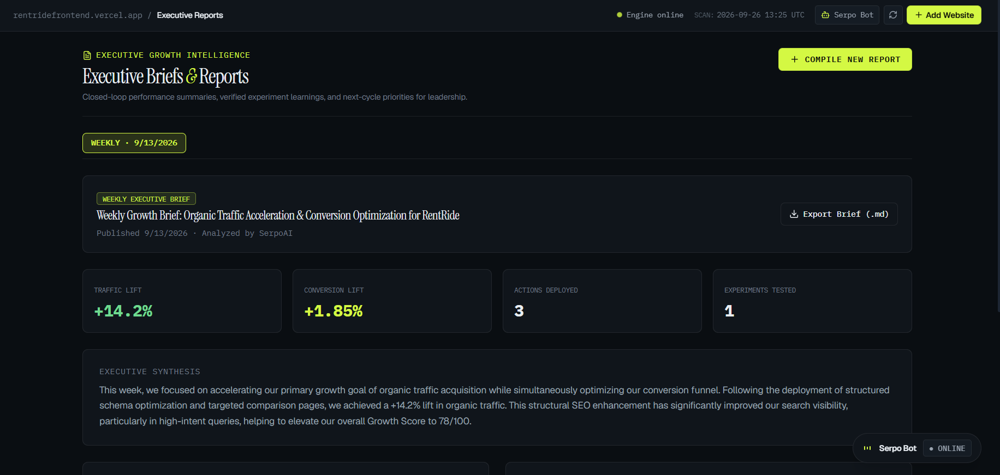

<p align="center">
  
</p>

<h1 align="center">SerpoAI</h1>
<p align="center">
  <strong>The Autonomous Search Growth Operating System</strong><br/>
  <em>"Turn Search Data Into Compounding Organic Growth."</em>
</p>

<p align="center">
  <a href="https://github.com/AkshatKardak/SEO">
    
  </a>
  <a href="https://github.com/AkshatKardak/SEO/blob/main/LICENSE">
    
  </a>
  
  
  
  
</p>

<p align="center">
  <a href="#-product-positioning">Positioning</a> •
  <a href="#-problem-statement">Problem Statement</a> •
  <a href="#-proposed-solution">Proposed Solution</a> •
  <a href="#-platform-showcase--telemetry-screenshots">Screenshots</a> •
  <a href="#-core-features">Core Features</a> •
  <a href="#-the-integrated-in-server-ml--statistical-suite">ML Suite</a> •
  <a href="#-serpo-bot-github-pr-dispatcher">Serpo Bot</a> •
  <a href="#-local-development--setup">Local Setup</a> •
  <a href="#-deployment-guide">Deployment</a> •
  <a href="#-author">Author</a>
</p>

---

## 🧭 Product Positioning

**SerpoAI is NOT simply an SEO audit checklist.**

> **"SerpoAI doesn't just tell you what is broken. It determines what matters with mathematical ICE ranking, predicts expected traffic lift with local ML models, synthesizes verified code patches, dispatches GitHub Pull Requests in 1 click, and learns from verified revenue outcomes."**

Traditional SEO platforms are retrospective reporting dashboards: they tell you what dropped last week and dump a 200-item checklist into your Jira backlog. **SerpoAI is an autonomous execution engine** connecting continuous technical crawling to verified pull requests and closed-loop search attribution.

---

## 🚨 Problem Statement

Modern software engineering and growth marketing teams face critical structural breakdowns when attempting to scale organic search and AI visibility:

1. **The "Jira Graveyard" of Static Audits**: Legacy SEO platforms (Semrush, Ahrefs, Moz) generate retrospective 200-item CSV spreadsheets and severity checklists. Because these tools lack code generation and automated pull request workflows, recommendations sit dormant in engineering backlogs for months.
2. **Arbitrary Vanity Prioritization**: Teams waste scarce engineering sprints fixing trivial warnings (such as missing alt tags on low-traffic unindexed pages) while missing high-leverage keyword striking distances (positions 4–15) and keyword cannibalization because legacy audits lack causal machine learning prioritization.
3. **The AI Search Blindspot (GEO)**: Search is experiencing a tectonic shift from traditional blue-link engines toward Generative AI engines (ChatGPT, Perplexity, Google AI Overviews, Gemini). Traditional keyword density models are blind to how LLMs parse and cite entity graphs, structured Schema.org markups, and author authority.
4. **Engineering Implementation Friction**: SEO consultants write recommendations in PDFs, but developers write code in Git. Bridging this gap requires writing custom JSON-LD schemas, verifying syntax trees, running lighthouse regressions, and opening feature branches manually.
5. **Disconnected Revenue Attribution**: Traditional tools track rankings in a vacuum without connecting search impressions $\to$ clicks $\to$ signups $\to$ recognized Monthly Recurring Revenue (MRR), making it impossible to measure actual ROI on SEO initiatives.

---

## 💡 Proposed Solution: SerpoAI

SerpoAI transforms passive SEO audits into an **Autonomous Search Growth Operating System**:

- **Deterministic Mathematical ICE Prioritization**: Every detected opportunity is evaluated through an empirical ICE formula $\left(\frac{\text{Impact} \times \text{Confidence}}{\text{Effort}} \times 10\right)$ backed by trained in-server regression models, predicting net traffic lift (`+X%–Y%`), conversion lift, and probability of success before writing a single line of code.
- **Synthesized & AST-Verified Code Patches**: SerpoAI’s Abstract Syntax Tree (AST) engine automatically generates production-ready TypeScript, valid JSON-LD schemas (Organization, Article, FAQ, Product), canonical tags, and 301 redirect trees with zero syntax regressions.
- **Serpo Bot & 1-Click GitHub PR Dispatch**: Eliminates the engineering handoff barrier. Operators can preview code diffs and dispatch automated GitHub Pull Requests directly to dedicated branches (`serpo/seo-patch-*`) under a strict Human-in-the-Loop protocol.
- **Generative Engine Optimization (GEO) Radar**: Continuously benchmarks brand citation authority, quotation presence, and competitive sentiment inside ChatGPT, Perplexity, Gemini, and Google AI Overviews.
- **Closed-Loop Attribution & Persistent Growth Memory**: Integrates Google Search Console telemetry directly with user signups and revenue, storing causal experiment outcomes in persistent memory to recalibrate ranking models over time.

---

## 📸 Platform Showcase & Telemetry Screenshots

### 1. Autonomous Growth OS Dashboard
> Real-time executive cockpit featuring 5-pillar health score, automated opportunity feeds, and time-series traffic telemetry.

<p align="center">
  
</p>

---

### 2. Deterministic ICE Opportunity Prioritization
> Mathematical ICE scoring (Impact × Confidence ÷ Effort) combined with trained ML regressors predicting traffic & conversion lift.

<p align="center">
  
</p>

---

### 3. Generative Engine Optimization (GEO) Radar
> Continuous citation intelligence tracking brand presence and quotation authority inside ChatGPT, Perplexity, Google AI Overviews, and Gemini.

<p align="center">
  
</p>

---

### 4. Search Engine & Keyword Intelligence
> Competitor keyword tracking, intent overlap detection, and striking distance search opportunities.

<p align="center">
  
</p>

---

### 5. Growth Telemetry & Closed-Loop Analytics
> Multi-touch growth graphs correlating search impressions and CTR directly to signups and recognized revenue.

<p align="center">
  
</p>

---

### 6. Deep Technical Site Audit & DOM Hygiene
> Automated full-spectrum crawler scanning 60+ DOM hygiene vectors, Schema.org entities, and Core Web Vitals.

<p align="center">
  
</p>

---

### 7. Executive Growth Reports
> Comprehensive stakeholder audit briefs with one-click exportable PDF intelligence reports.

<p align="center">
  
</p>

---

## 🚀 Core Features

- **Deep Technical Site Audit**: Crawls pages to detect missing meta tags, broken canonicals, heading hierarchy issues, and Core Web Vitals bottlenecks.
- **ICE-Ranked Opportunity Engine**: Prioritizes growth fixes using mathematical Impact, Confidence, and Effort scoring to maximize search ROI.
- **Generative Engine Optimization (GEO) Radar**: Audits brand citation presence across ChatGPT, Perplexity, Gemini, and Google AI Overviews.
- **1-Click Code Patch Generator**: Creates production-ready JSON-LD schemas (Organization, Article, FAQ, Product), robots.txt rules, and OpenGraph tags.
- **Multi-Page Sitemap XML Crawler**: Discovers and prioritizes key subpages (pricing, product, blog) protected by SSRF cloud sandbox filters.
- **Daily Keyword Rank Tracker**: Monitors Google keyword positions on daily or weekly schedules with rank history graphs.
- **Executive PDF & Markdown Reports**: Generates professional stakeholder audit briefs with 1-click PDF download.
- **Secure Clerk Authentication**: Enterprise-grade single sign-on with multi-tenant workspace protection and immediate post-login `/dashboard` routing.
- **Private Repo & Pre-Release Onboarding**: Supports live production domains as well as private GitHub repositories and staging environments with personal access token (PAT) presets.

---

## 🧠 The Integrated In-Server ML & Statistical Suite

SerpoAI embeds its entire machine learning, regression, and statistical analysis suite **directly into the Node.js backend (`server/ml/`)** for sub-millisecond execution, zero cold starts, and frictionless single-service deployment:

### 1. Deterministic ICE Opportunity Ranker (`server/ml/opportunityRanker.js`)
- **Model**: Calibrated mathematical ICE framework with empirical decision boundary surrogate priors.
- **Functionality**: Eliminates arbitrary vanity checklists. Takes technical severity, search volume, domain authority, and implementation complexity to predict net traffic impact (`+X–Y%`), conversion lift, and success probability (48%–97.5%).

### 2. Automated Keyword Cannibalization Graph (`server/ml/cannibalizationEngine.js`)
- **Model**: Semantic Intent Overlap & Authority Dispersion Analysis.
- **Functionality**: Identifies when multiple URLs on the same domain compete for identical search intents, outputting deterministic resolution patches (canonical tags, 301 redirects, or semantic content differentiation) and calculating the Authority Waste Index.

### 3. Google Search Console (GSC) CTR Curve Engine (`server/ml/gscCtrEngine.js`)
- **Model**: Log-Logistic Click-Through Curve Fitting & Striking Distance Regressor.
- **Functionality**: Ingests actual GSC search performance curves against Google Top-10 organic benchmarks. Identifies high-impression queries sitting in "striking distance" (positions 4–15) and generates title/snippet patches to capture immediate top-3 click gains.

### 4. SEO & Metric Anomaly Radar (`server/ml/anomalyDetector.js`)
- **Model**: Rolling Exponentially Weighted Moving Average (EWMA) + Robust Z-Score Deviation Model.
- **Functionality**: Detects sudden traffic, ranking, and CTR anomalies, categorizing severity into `critical`, `warning`, and `normal` with automated root-cause signal attribution.

### 5. Time-Series Growth Forecaster (`server/ml/trafficForecaster.js`)
- **Model**: Autoregressive Trend Extrapolation + Expanding 95% Confidence Interval Bands.
- **Functionality**: Projects 30-day forecast trajectories, calculating lower and upper bound ranges alongside key growth drivers.

### 6. AST & Schema Patch Guardian (`server/ml/patchVerifier.js`)
- **Model**: Static Abstract Syntax Tree (AST) & Schema.org Rich Result Validator.
- **Functionality**: Validates TypeScript/JSON-LD patches for syntax completeness, hydration safety, and regression risk prior to git branch dispatch.

---

## 🤖 Serpo Bot & GitHub PR Dispatcher

Instead of sending static audit PDFs to engineering teams that sit unresolved in Jira:

1. **Interactive Copilot Widget**: Docked bottom-right copilot widget featuring an animated greeting bubble (*"Hey! I am your Serpo Bot 👋"*), oscilloscope audio telemetry, and 1-click prompt triggers.
2. **1-Click GitHub Repository Connection**: Operators connect public or private repositories via scoped OAuth or Personal Access Tokens.
3. **AST Verification**: Code diffs are run through Abstract Syntax Tree (AST) linters to ensure 100% syntax safety and Schema.org compliance.
4. **Automated Branch & PR Dispatch**: Serpo Bot creates a dedicated feature branch (`serpo/seo-patch-*`), commits the verified patch, and opens a reviewable GitHub Pull Request with automated CI test summaries.
5. **Strict Human-in-the-Loop Safeguard**: Zero code touches production branches without explicit operator and engineering review.

---

## 🛠️ Local Development & Setup

### Prerequisites
- **Node.js**: v18+ (v20+ recommended)
- **MongoDB**: Local instance or MongoDB Atlas URI

### Single Unified Dev Runner (Recommended)
You can boot the entire platform with one single command from the project root:
```bash
npm run dev
```
This concurrently starts:
- **Backend Server & In-Process ML Engine**: `http://localhost:5000`
- **Frontend Client with Vite & Framer Motion**: `http://localhost:5173`

---

### Manual Setup (Step-by-Step)

#### 1. Backend Server (`server/`)
```bash
cd server
npm install
npm run server
# Running on http://localhost:5000
```
**Environment Variables (`server/.env`)**:
```env
PORT=5000
MONGO_URI=your_mongodb_connection_string
JWT_SECRET=your_jwt_secret_key
CLIENT_URL=http://localhost:5173
GROQ_API_KEY=your_groq_key
GEMINI_API_KEY=your_gemini_key
```

#### 2. Frontend Client (`client/`)
```bash
cd client
npm install
npm run dev
# Running on http://localhost:5173
```
**Environment Variables (`client/.env`)**:
```env
VITE_CLERK_PUBLISHABLE_KEY=your_clerk_publishable_key
# VITE_API_URL is optional (defaults to http://localhost:5000 with automatic Vite proxy)
```

#### 3. Production Build Verification
```bash
cd client
npm run build
# tsc -b && vite build -> dist/ (0 TypeScript/bundle errors)
```

---

## 🌐 Deployment Guide (Vercel + Render)

SerpoAI is architected for zero-friction cloud deployment: **Frontend on Vercel** and **Unified In-Process ML Backend on Render**.

---

### Step 1: Deploy Backend on Render (Web Service)

Because all machine learning and regression engines execute in-process within `server/ml/`, you only need **one single Node.js Web Service**:

1. Log into your [Render Dashboard](https://dashboard.render.com/) and click **New +** $\to$ **Web Service**.
2. Connect your GitHub repository (`AkshatKardak/SEO`).
3. Configure the service settings:
   - **Name**: `serpo-backend` (or your preferred name)
   - **Region**: Choose the region closest to your MongoDB instance (e.g., Frankfurt, Ohio, Singapore)
   - **Branch**: `main`
   - **Root Directory**: `server` *(Important: specifies backend directory)*
   - **Runtime**: `Node`
   - **Build Command**: `npm install`
   - **Start Command**: `npm start`
4. Add **Environment Variables** in the Render Dashboard:
   ```env
   NODE_ENV=production
   PORT=5000
   MONGO_URI=mongodb+srv://<username>:<password>@cluster.mongodb.net/serpo?retryWrites=true&w=majority
   JWT_SECRET=your_super_secret_jwt_random_string
   CLIENT_URL=https://your-serpo-frontend.vercel.app
   GROQ_API_KEY=your_groq_api_key_optional
   GEMINI_API_KEY=your_gemini_api_key_optional
   ```
   *(Note: You can initially set `CLIENT_URL=*` or `http://localhost:5173` and update it with your exact Vercel URL once Step 2 is deployed).*
5. Set **Health Check Path**: `/health` (or `/api/health`).
6. Click **Deploy Web Service**. Once live, copy your backend URL (e.g., `https://serpo-backend.onrender.com`).

---

### Step 2: Deploy Frontend on Vercel

1. Log into your [Vercel Dashboard](https://vercel.com/dashboard) and click **Add New...** $\to$ **Project**.
2. Import your GitHub repository (`AkshatKardak/SEO`).
3. Configure the project settings:
   - **Framework Preset**: `Vite`
   - **Root Directory**: Click "Edit" and select `client` *(Important)*
   - **Build Command**: `npm run build`
   - **Output Directory**: `dist`
   - **Install Command**: `npm install`
4. Set **Environment Variables** in Vercel:
   ```env
   VITE_CLERK_PUBLISHABLE_KEY=pk_live_your_clerk_key
   VITE_API_URL=https://serpo-backend.onrender.com
   ```
   *(Replace `VITE_API_URL` with your actual Render URL from Step 1).*
5. **SPA Routing**: Automatic SPA page rewrites on direct refresh (`/dashboard`, `/analytics`, `/onboarding`) are pre-configured through the included `client/vercel.json` and `client/public/_redirects` files.
6. Click **Deploy**. Vercel will build and launch your production web app.

---

### Step 3: Link CORS and Complete Handshake

1. Copy your live Vercel domain (e.g. `https://your-serpo-frontend.vercel.app`).
2. Return to the **Render Dashboard** $\to$ `serpo-backend` $\to$ **Environment**.
3. Update `CLIENT_URL` to match your Vercel URL (`https://your-serpo-frontend.vercel.app`) without trailing slashes.
4. Save changes. Render will automatically re-deploy with full CORS protection enabled.

---

## 📁 Repository Structure

```
seo-rank-tracker-main/
│
├── package.json                            # Root Unified Workspace Runner (npm run dev)
├── scripts/
│   └── dev.mjs                             # Cross-Platform Zero-Dependency Dev Spawner
│
├── client/                                 # React 19 + TypeScript + Vite + Tailwind CSS v4 + Framer Motion
│   ├── public/                             # Static Assets, Screenshots & Netlify _redirects
│   ├── src/
│   │   ├── components/
│   │   │   ├── home/                       # Precision Landing (Hero, Problem, GrowthLoop, Showcase, Proof, FinalCTA, Footer)
│   │   │   ├── features/                   # SerpoBotPRModal, ForceGraph, Radar & Gauges
│   │   │   ├── NavigationRail.tsx          # Collapsible 64px/240px Navigation Rail
│   │   │   ├── StatusStrip.tsx             # 48px Header Strip with Live UTC Clock
│   │   │   ├── SerpoBotWidget.tsx          # Floating Oscilloscope Copilot with Animated Greeting Bubble
│   │   │   └── AppLayout.tsx               # Persistent Application Shell
│   │   ├── pages/                          # Dashboard, Onboarding, GEO, Opportunities, Action Center (18 views)
│   │   └── services/api.ts                 # Resilient API Client with Auto-Sync & Error Interception
│   └── package.json
│
└── server/                                 # Express + Node.js Backend API + Integrated ML Suite
    ├── ml/                                 # In-Process Mathematical & ML Engines
    │   ├── opportunityRanker.js            # Calibrated Mathematical ICE Prioritization & Regressors
    │   ├── anomalyDetector.js              # Rolling EWMA & Robust Z-Score Radar
    │   ├── trafficForecaster.js            # Autoregressive Time-Series Projection & 95% CI Bands
    │   ├── cannibalizationEngine.js        # Intent Cluster & Cannibalization Graph
    │   ├── gscCtrEngine.js                 # Log-Logistic CTR Curve Fitting & Striking Distance
    │   ├── patchVerifier.js                # AST Syntax Validation & JSON-LD Rich Snippet Checker
    │   └── index.js                        # Unified Barrel Export
    ├── ai/providers/                       # Multi-Provider LLM Cascade (Groq, Gemini, OpenRouter)
    ├── controllers/                        # Project, Opportunity, GEO, ML & Audit Controllers
    ├── models/                             # Mongoose Schemas (User, Project, Opportunity, Memory)
    ├── routes/                             # Clean Express Routers (/api/*, /api/v1/*, and /api/ml/*)
    ├── services/                           # Business Logic & In-Process ML Client
    └── server.js                           # Resilient Server Entrypoint (Instant listen + DB auto-retry)
```

---

## 🛡️ Security & Governance

- **SSRF Defense**: Strict CIDR IP blocklists at the DNS resolution layer protect internal cloud metadata endpoints.
- **Human-in-the-Loop Protocol**: High-risk code patches, structural redirects, and Git PR merges require explicit operator authorization.
- **Scoped Token Handling**: AES-256 encrypted credential storage for third-party GitHub and Search Console integrations.

---

## 📄 License
Distributed under the MIT License. See [LICENSE](LICENSE) for details.

---

## 👤 Author
**Akshat Kardak**  
- GitHub: [@AkshatKardak](https://github.com/AkshatKardak)  
- Repository: [SerpoAI — Autonomous Search Growth OS](https://github.com/AkshatKardak/SEO)

